# Murmur

**Know the moment your agents need you. Ignore them the rest of the time.**

A Claude Code session blocks silently: a question waits in a terminal you are not looking at, a permission prompt sits under three other windows, and twenty minutes disappear. Murmur is the pager that fixes this. When Claude genuinely needs a human, the question or permission prompt lands somewhere you will see it: a card in your browser, a background push, or a native macOS alert. You answer from there and the session unblocks.

Around that pager sits a live dashboard: every tool call, sub-agent, workflow, question, and dollar of the session, mirrored to the browser in real time. Watch it when you want to. The point is that you do not have to.

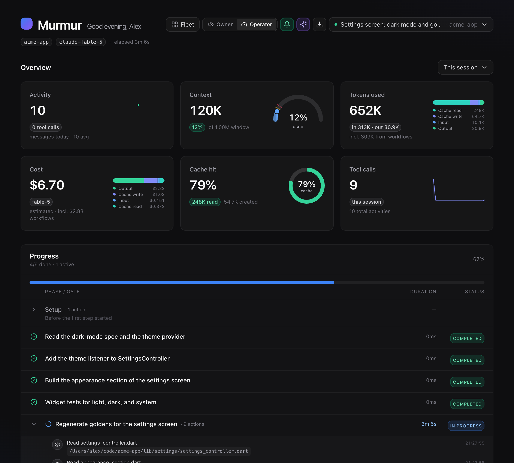
*The Operator view: live KPIs over the full panel stack.*

---

## Contents

- [Install](#install)
- [The pager: questions and permissions](#the-pager-questions-and-permissions)
- [Alert channels](#alert-channels)
- [The dashboard: two views](#the-dashboard-two-views)
- [What it surfaces](#what-it-surfaces)
- [The fleet](#the-fleet)
- [Sessions and multi-session](#sessions-and-multi-session)
- [Sharing and export](#sharing-and-export)
- [MCP tools](#mcp-tools)
- [Updating and removing](#updating-and-removing)
- [Troubleshooting](#troubleshooting)
- [How it works](#how-it-works)
- [Configuration](#configuration)
- [Develop](#develop)

---

## Install

```bash
git clone https://github.com/siavash-mohseni/murmur.git && cd murmur && bun run setup
```

**Prerequisites:** [Bun](https://bun.sh) (build only), Node.js, and the Claude Code `claude` CLI on your `PATH` (setup prints the manual `claude mcp add` line if it is missing). That is the whole list. The hooks are a single dependency-free Node script, so jq and curl are not needed. On macOS, `swiftc` (Xcode Command Line Tools) is optional: when present, setup builds a nicer native alert, and when absent the channel falls back to AppleScript.

`bun run setup` installs dependencies, builds the web bundle and server, then wires everything into `~/.claude`:

- copies the **hook** (`murmur-hook.mjs`) into `~/.claude/hooks` and rewrites its `MURMUR_ROOT` to wherever you cloned the repo,
- copies the bundled **skills** (`murmur`, `progress-dashboard`) into `~/.claude/skills`,
- idempotently merges the six hook registrations into `~/.claude/settings.json` (a re-run never duplicates entries, the file is backed up to `settings.json.bak` first, and any legacy bash-hook entries from older installs are migrated out),
- injects the Murmur sections into `~/.claude/CLAUDE.md` between managed `<!-- BEGIN MURMUR -->` markers (idempotent, backed up to `CLAUDE.md.bak`),
- registers the MCP server with Claude Code at user scope,
- finishes with an end-to-end smoke: it boots the built server in an isolated temp `HOME` and drives the real mirror hook through it, so a broken pipeline fails the install instead of showing up later as a silently empty dashboard.

Restart Claude Code afterwards. Then send any prompt containing `--murmur`: Claude opens the dashboard and prints its URL once (for example `http://127.0.0.1:5173/`). Murmur stays on until you say "murmur off" or start a new session. For always-on, set `MURMUR_AUTO=1` in your shell and every session behaves as if you typed `--murmur`.

If anything misbehaves, `bun run doctor` reports the live state of the whole pipeline in one shot: dependencies, build, hook file and registrations, skills, the CLAUDE.md block, MCP registration, every live session server (with connected-tab counts), and the tail of `warnings.log`.

## The pager: questions and permissions

**Questions.** When Murmur is on, Claude routes questions through `murmur_ask` instead of the terminal. The question renders as a card in the pane, your answer flows back to the blocked tool call, and the session continues. Every pending card shows a live countdown to its timeout. If it lapses unanswered, the card is replaced by a feed entry saying the question timed out and Claude continued, so a decision made without you is never silent.

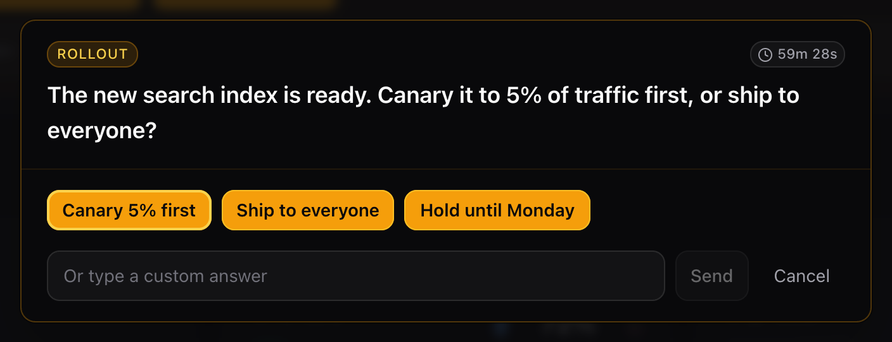

**Permissions.** A hook on the PermissionRequest event routes permission prompts to the same surface, with Allow once / Always allow / Deny, but only when Claude Code would show a permission dialog. Allowlisted, auto-approved, and bypass-permissions commands never raise a Murmur modal, so Murmur can never add a prompt the harness would not have shown.

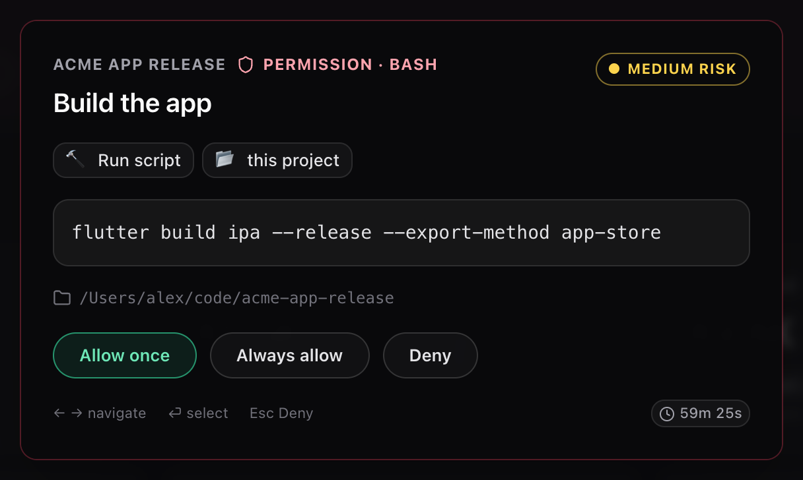

**The watcher gate.** Questions and permissions are only routed to Murmur when someone can see them there: a dashboard tab is connected, or the native alert channel is on. Close the tab and leave the session running, and the hooks detect zero watchers and let the terminal prompt through instead, while `murmur_ask` fails fast rather than blocking invisibly. A session with Murmur installed is therefore never less responsive than one without it.

## Alert channels

Three channels, chosen from the toggle in the session header (the fleet view has its own menu for the background channel). They stack, so enable any combination.

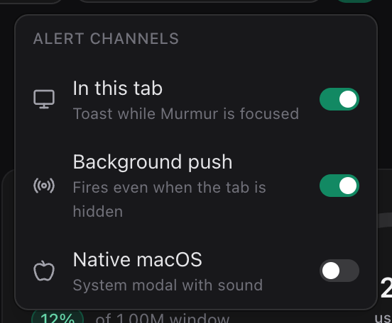

- **In this tab**: the in-page overlay for questions and permissions.
- **Background**: a service-worker push that fires even when the tab is not focused. It needs a Murmur tab open somewhere, and the preference persists in the browser Cache API.
- **Native (macOS)**: a native modal alert, opt-in from the chooser. The choice persists across restarts and is shared by every port (stored in `~/.claude/state/murmur/native-alert.pref`).

The browser tab title also flashes when something needs you, so a background tab is enough to notice.

## The dashboard: two views

A toggle in the header switches between two views of the same session. The choice persists.

### Owner view

The glanceable, plain-language view for when you are not the one driving. A status hero ("what is Claude doing right now"), a timeline of outcomes, an inbox for anything that needs you, and plain-language summaries generated on demand. It celebrates completion and keeps a heartbeat so you can tell at a distance whether work is still moving.

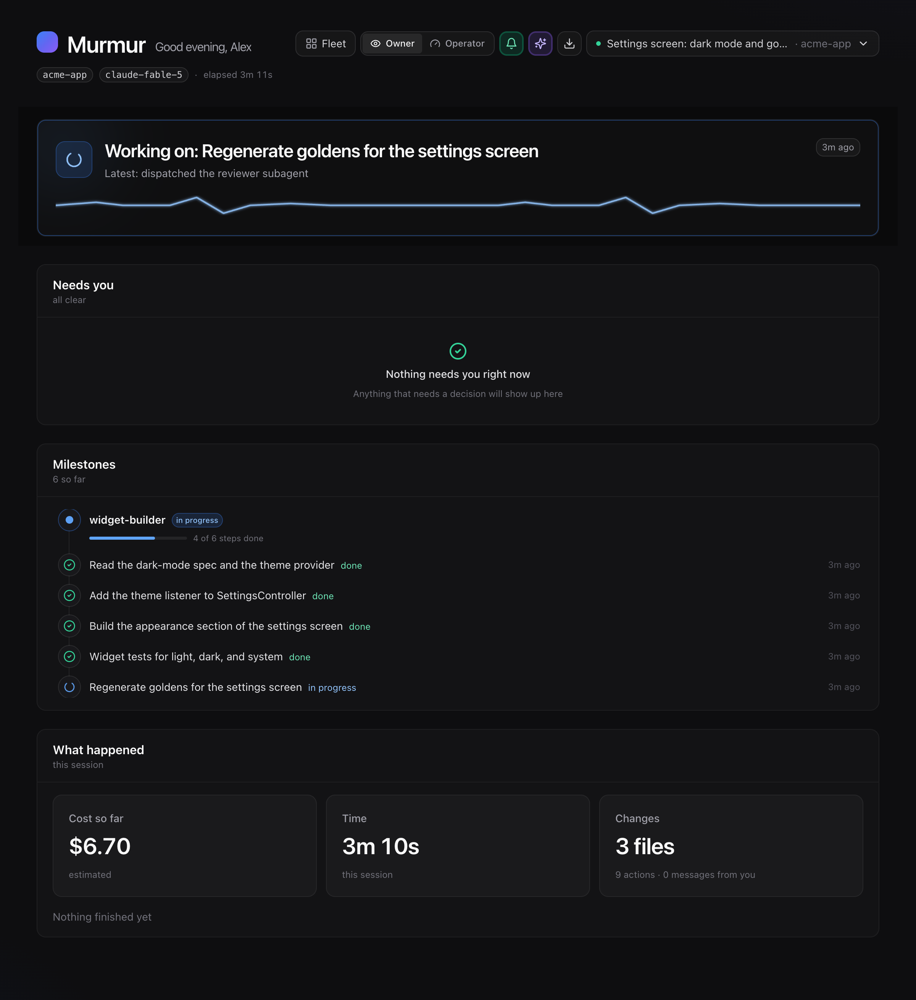

### Operator view

The expert dashboard. A KPI grid across the top, then the full panel stack below. A period picker (session, today, and wider windows) rescopes the KPIs and panels.

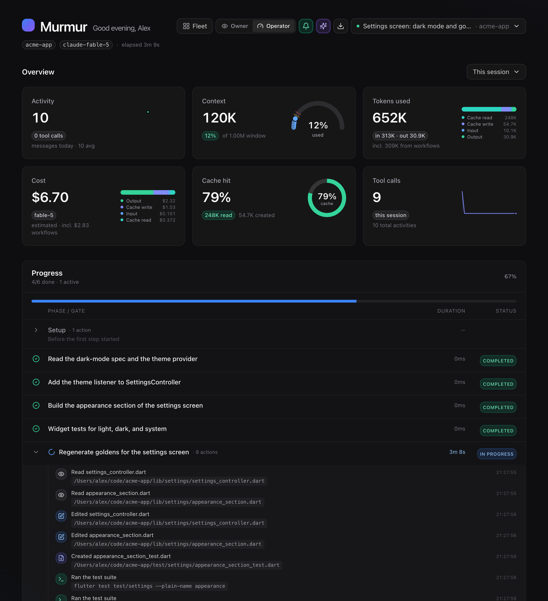

| Tile | Shows |
|---|---|
| Activity | Messages and tool calls, with a sparkline and a rolling average. |
| Context | Live context-window usage as a gauge, with warn and cliff thresholds. |
| Tokens used | Total tokens, split into input, output, and cache, including tokens spent by workflows. |
| Cost | Estimated session cost for the current model, workflow cost folded in. |
| Cache hit | Cache read share as a donut. |
| Tool calls | Tool-call count for the period, with a sparkline. |

**Banners** appear only when relevant: a context-tier warning as you approach the window limit, a stuck-session warning, and a banner when another session is waiting on input.

## What it surfaces

**Panels** (Operator view): Progress (`TaskCreate` / `TaskUpdate` rows grouped into runs and named by goal), Activity (the past-tense trace with inline image thumbnails), Tool breakdown, Sub-agents, Background tasks, Slash commands, Skills loaded, Routines, Memory, and Files touched.

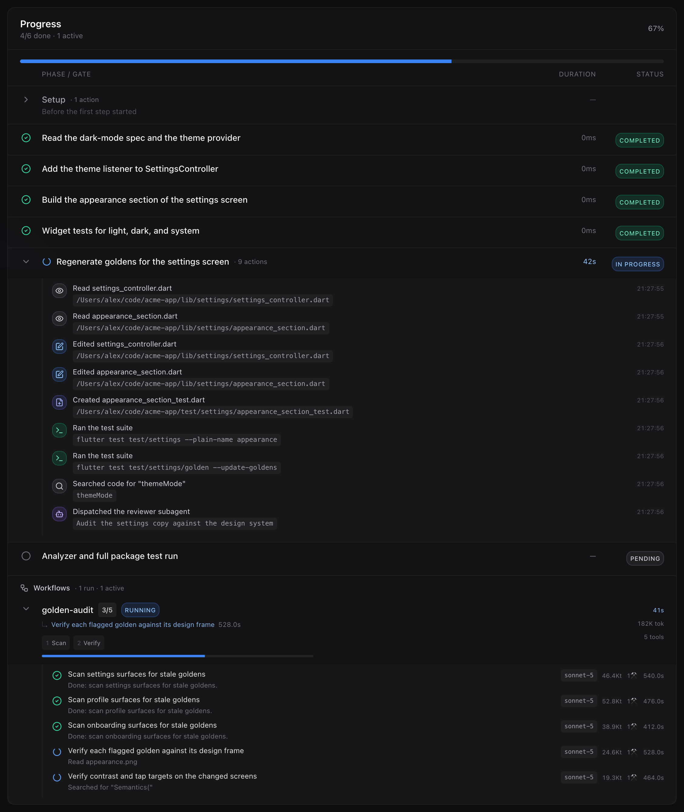

**Workflows.** When Claude runs a dynamic workflow (multi-agent orchestration), Murmur mirrors it live: the declared phases, done/total counts, the longest-running agent, and the token cost, folded into the session Cost KPI. This reads the workflow's journal on a short poll, with no extra instrumentation in the workflow itself.

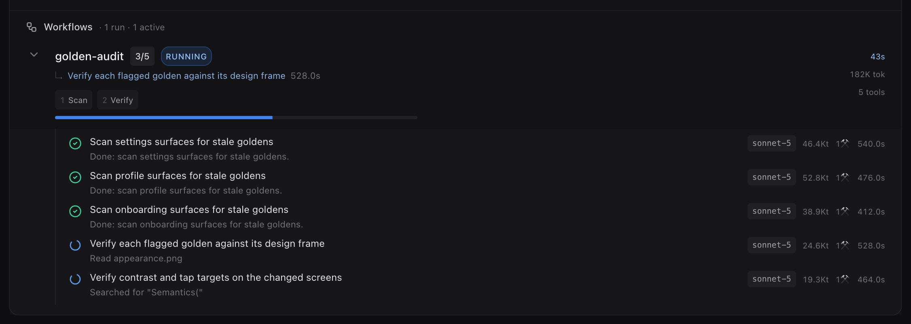

**Dimensions.** Custom usage tags from `OTEL_RESOURCE_ATTRIBUTES` (for example `team`, `repo`) show as session chips, so you can tell at a glance which project or team a session belongs to.

## The fleet

Run more than one session and Murmur becomes mission control. A small hub process starts automatically with the first session (one per machine, on port 4747) and serves the **fleet home**: every live session as a card, blocked ones first, each showing status, last activity, task progress, context usage, and cost. A global "Needs you" inbox at the top collects every pending question and permission across all sessions, answerable inline. Clicking a card drills into that session's full Operator and Owner dashboard on the same origin, and the Fleet button brings you back.

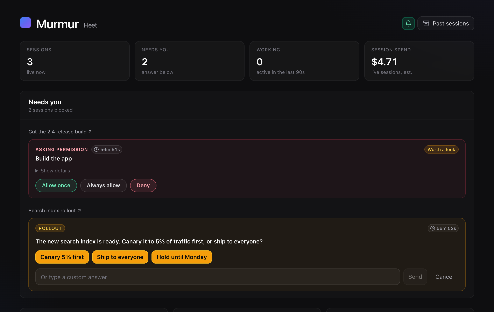

When a session blocks, it sorts to the top and the "Needs you" inbox surfaces the question or permission with the answer controls inline, so you clear it without leaving the fleet.

<p align="center">
  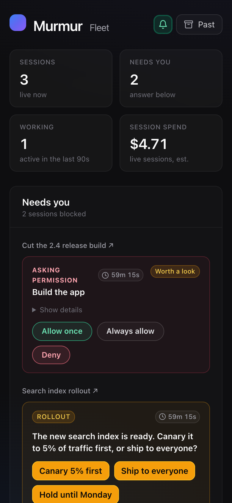
</p>

The hub observes sessions through the same watcher discipline as everything else: its own mirror connection never counts as a human, so an unwatched session still falls back to the terminal prompt. Only when a fleet tab is open does the hub tell sessions their prompts are visible. The hub spawns lazily and exits on its own after half an hour with nothing to do. It is loopback-only: it binds `127.0.0.1`, so the dashboard is reachable only from this Mac.

## Sessions and multi-session

Each Claude Code session owns its own Murmur instance on its own port (5173, 5174, and so on). The header shows the current session's metadata (working directory, model, start time, staleness). Murmur also lists every live Claude Code session on the machine, including what a waiting session is blocked on, and the session switcher lets one browser tab hop between them (under the hub this is an instant route change). A browse-past entry opens earlier sessions.

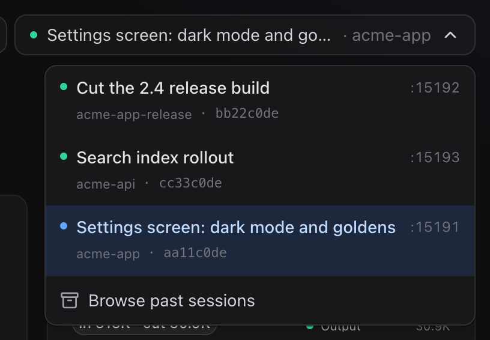

## Sharing and export

The header has share controls that produce self-contained HTML: a plain-language summary you can open and hand off, and a full session export. Both are single files with no external dependencies, so you can share a snapshot of a run without giving anyone access to your machine.

The same documents render server-side from persisted state, so past sessions export too and transcript images come inlined as data URIs:

- **HTTP**: `GET /export/<key>.html` on the hub or any session server (`?kind=data` for the dense dump instead of the narrative summary). A session server renders its own key from the live snapshot.
- **CLI**: `murmur-export` lists every session on disk, `murmur-export <key prefix>` writes the summary next to you, `--data` and `--out` adjust what and where. No server needs to be running.

**PR receipts.** `murmur-export <key> --receipt` turns a session into a receipt on the pull request it produced: the summary goes into a secret gist (visible to whoever has the link, which is who can read the PR), and a marker-guarded line is appended to the PR body with the gist and a one-click preview. Re-running replaces the previous receipt instead of stacking duplicates. `--pr <n>` targets a specific PR, `--no-pr` skips the append. Needs the GitHub CLI (`gh`). The receipt carries the full trace, including every permission decision, so a reviewer can see not just the diff but how it was made.

**PII redaction.** Every document that leaves the machine is anonymized by default: exports, receipts, and the browser share buttons all scrub emails, API keys and tokens (Anthropic, OpenAI, GitHub, Slack, AWS, Google, JWTs, bearer headers, `password=`/`api_key=` style assignments), home-directory usernames (`/Users/jane` becomes `/Users/USER`, including the bare name and its `-Users-jane-` project-slug form), non-loopback IPv4 addresses, and Luhn-valid card numbers. The rules are conservative on purpose so code, diffs, git SHAs, UUIDs, and timestamps come through untouched, and they cover text only: screenshots inlined in the transcript are not scrubbed, and phone numbers are left alone because diff lines starting with `+` look identical to them. The live dashboard itself is never redacted (it is your own machine). To export full fidelity, pass `--no-redact` to the CLI or `?redact=0` to `/export/<key>.html`.

## MCP tools

Murmur exposes five tools. In normal use you only call `murmur_open` and `murmur_ask` directly. The hooks and the skill drive the rest.

| Tool | Purpose |
|---|---|
| `murmur_open` | Open the browser surface for this session and return its URL. Optional `port` and `open` (set `open: false` to skip launching a browser). |
| `murmur_init` | Seed a new run of progress rows. Takes `rows` (string list) and an optional `title`. Each call appends a separate run rather than replacing earlier ones. |
| `murmur_update` | Update one progress row: `row` (its exact text), `status` (`pending` \| `in_progress` \| `completed` \| `failed`), and an optional `detail`. This is also how you turn a row red, which the harness `TaskUpdate` cannot do. |
| `murmur_log` | Append a status line to the activity feed, for narrative updates that would otherwise be silent prose. |
| `murmur_ask` | Ask the user a question in the pane and block for the answer. Same shape as `AskUserQuestion`. Returns `{ ok, answer }`, or `{ ok: false, reason }` so the caller can fall back to `AskUserQuestion`. |

**Surface boundary.** Pick the tool by tense and durability: `TaskCreate` / `TaskUpdate` for the operational status of committed work, `murmur_log` for a past-tense trace, `murmur_ask` for discrete answers from the human, and `Write` to `memory/` for durable cross-session preferences.

## Updating and removing

**Update.** Pull the latest and re-run setup:

```bash
git pull && bun run setup
```

The re-run is idempotent: it never duplicates hook registrations, replaces the CLAUDE.md block in place, migrates legacy hook entries out, and backs up `settings.json` and `CLAUDE.md` before writing. Restart Claude Code to pick up the rebuilt server.

**Remove.**

```bash
bun run uninstall:murmur          # keep session traces
bun run uninstall:murmur --purge  # also delete ~/.claude/state/murmur
```

The uninstall reverses everything setup wired in: the hook, the settings registrations (yours are left untouched), the managed CLAUDE.md block, the MCP registration, and the skills. It is idempotent and tolerant of partial installs. Afterwards, delete the clone.

## Troubleshooting

| Symptom | Cause and fix |
|---|---|
| The dashboard never opens on a `--murmur` prompt | You did not restart Claude Code after setup, so the MCP server and hooks are not loaded yet. Restart, then try again. |
| `claude mcp add` failed during setup | The `claude` CLI is not on your `PATH`. Run the manual `claude mcp add` command that setup printed. |
| Rows and activity do not appear | Run `bun run doctor`: it checks the hook file and registrations, live session servers, and tails `warnings.log`. |
| Anything else misbehaves | `bun run doctor` first. Server-side mirror failures are logged to `~/.claude/state/murmur/warnings.log`. |
| Port 5173 is busy | Murmur automatically binds the next free port (5174, 5175, and so on) and writes a port file so the browser and hooks find it. No action needed. |
| The native macOS alert looks like a plain dialog | The nicer SwiftUI helper needs `swiftc` at build time. Install the Xcode Command Line Tools and re-run `bun run setup`. Without it the channel still works via AppleScript. |
| Setup says `dist/index.js not found` | You ran `bun scripts/setup.ts` without building first. Use `bun run setup`, which builds before wiring. |

## How it works

Murmur is read-mostly by design: it observes the session and relays the two things Claude genuinely needs a human for, answers and permission decisions. It never drives the session, so there is nothing it can break.

- **Per-session server.** The MCP child starts a local HTTP server on the first free port from 5173 up, bound to `127.0.0.1`, and writes a port file under `~/.claude/state/murmur/sessions/` so the hook and the browser can find the right instance. Its lifetime is tied to the parent Claude Code process, so it exits with the session.
- **The hub.** A detached per-machine process (`dist/hub.js`, port 4747) spawned lazily by the first session server that finds none. It tails every session's `/events` with `?role=mirror` (excluded from watcher counts), serves the fleet home and `GET /fleet`, reverse-proxies `/s/<key>/*` to the owning session, and heartbeats `POST /watchers/remote` while a fleet tab is open, so prompts route to Murmur only when someone can see them. Idle for thirty minutes with no sessions and no clients, it exits.
- **Guards.** Both servers bind `127.0.0.1` only. They also reject `Host` headers that do not name the machine (DNS rebinding) and cross-site `Origin`s on mutating requests (CSRF), the two ways a victim's own browser can be turned against a loopback server.
- **One hook, six events.** Setup registers a single dependency-free Node script, `~/.claude/hooks/murmur-hook.mjs`, under six events. Each invocation posts to the session's local server and silent-fails when Murmur is not listening.

| Event | Subcommand | Role |
|---|---|---|
| PostToolUse | `mirror` | Mirrors tool calls into the Activity and Progress surfaces. |
| PermissionRequest | `permission` | Routes a permission prompt to the dashboard (only when the CLI would prompt). |
| PreToolUse (`AskUserQuestion`) | `question` | Redirects questions to `murmur_ask`. Skips the Murmur repo itself. |
| UserPromptSubmit | `user-prompt` | Captures your prompts into the feed and injects the routing reminder. |
| PreCompact | `precompact` | Marks a context compaction in the trace. |
| Stop | `stop` | Marks the session idle when a turn ends. |

- **State.** Per-session state (rows, activities, questions, token stats) lives under `~/.claude/state/murmur/` and is persisted so a reload does not lose the trace.
- **Feeds.** The hook POSTs to `/sync`. The browser reads a full snapshot from `/state` and streams updates over `/events`. Two server-side polls run without any hook: a workflow mirror (tails the workflow journal) and an agents mirror (`claude agents --json`).
- **Endpoints.** Question and permission answers come back over `/api/answer`, `/api/cancel`, and `/api/permission/answer`. Owner-view summaries are generated on demand via `/api/owner/summary`. Transcript images are served from `/api/image/`, and `/export/<key>.html` renders a self-contained session document from persisted state (the HTML builders live in `src/export/` and are shared verbatim with the browser Share buttons).
- **Bundled skills and CLAUDE.md.** Two skills ship in the repo: `murmur` (the activation skill, holding the artifact design system) and `progress-dashboard` (the fallback route for multi-phase progress). Setup also injects three sections into `~/.claude/CLAUDE.md`, sourced from `claude-md/murmur.md`.

## Configuration

Environment variables, all optional:

| Variable | Effect |
|---|---|
| `MURMUR_AUTO=1` | Always-on mode: every session auto-opens the dashboard on its first prompt and routes as if `--murmur` was typed. |
| `OTEL_RESOURCE_ATTRIBUTES` | `team=...,repo=...` style tags, surfaced as session chips. |
| `MURMUR_HUB=0` | Disable the hub: no fleet home, no lazy hub spawn. Sessions serve their own dashboards as before. |
| `MURMUR_HUB_PORT` | Hub port override (default 4747). |
| `MURMUR_AGENTS_POLL=0` | Disable the `claude agents --json` poll (useful for CI or headless runs). |
| `MURMUR_WORKFLOW_PREVIEWS=0` | Suppress workflow preview text. |
| `CLAUDE_MURMUR_PORT` | Manual port override for the hook (debugging). |
| `MURMUR_DEBUG_ENV` | Dump Claude-related env vars on startup (diagnostics). |

`MURMUR_MAC_MODAL` is deprecated and no longer forces the native alert on. Use the channel chooser instead.

## Develop

```bash
bun run dev      # run the server from source on :5173
bun run build    # web + server (+ setup/uninstall bins)
bun run smoke    # smoke tests
node scripts/mirror-hook-smoke.mjs   # hook -> server -> state round-trip
node scripts/hook-paths-smoke.mjs    # question/permission blocking paths
node scripts/hub-smoke.mjs           # hub, fleet, proxy, watcher relay
node scripts/export-smoke.mjs        # export CLI, server routes, image inlining
bun scripts/redact-smoke.ts          # PII redaction rules and share-context walk
node scripts/make-icons.mjs          # regenerate the PWA icon set
```

Type-check with `bunx tsc --noEmit` at the repo root (server) and inside `web/` (dashboard). The macOS alert helper builds separately with `bun run build:native` (needs `swiftc`) and is also built opportunistically by setup.
